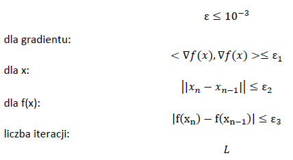
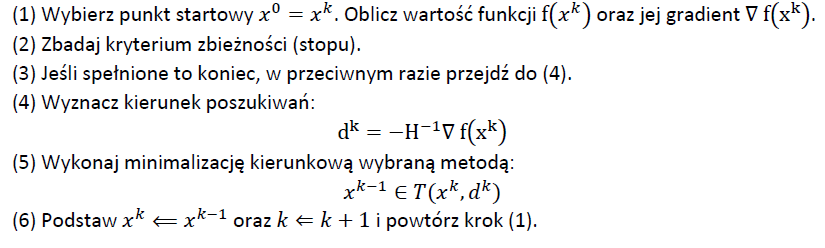
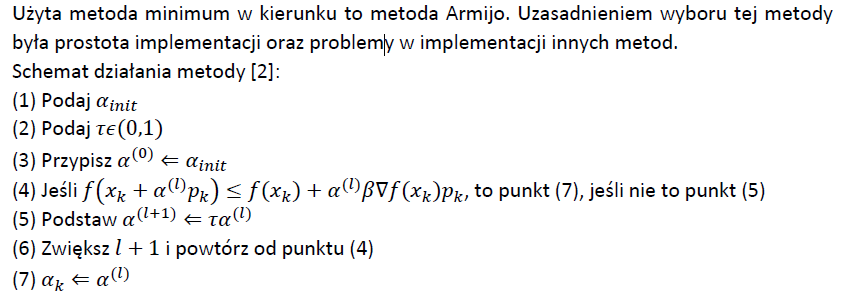
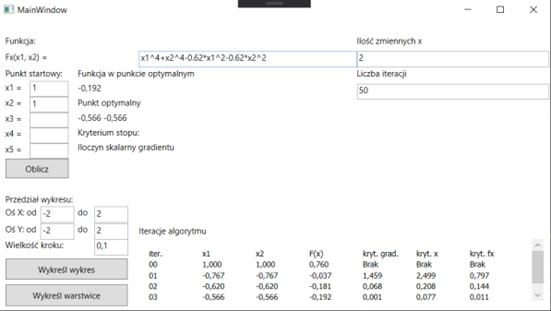
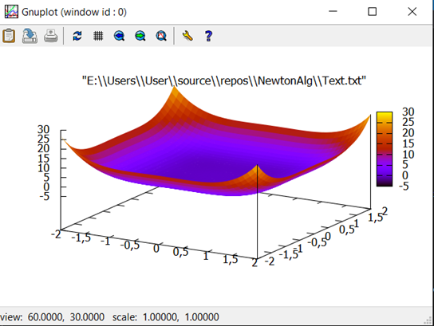
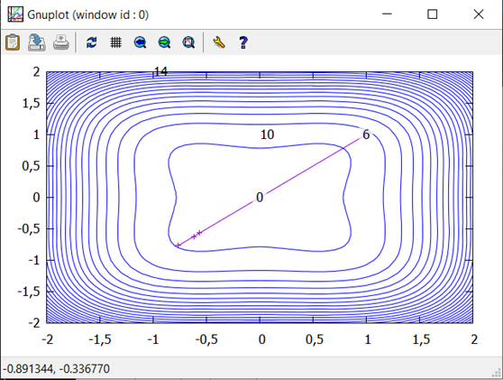
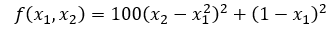
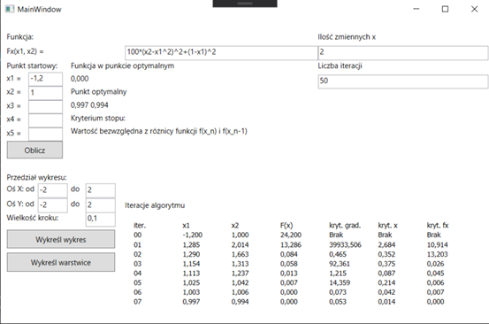
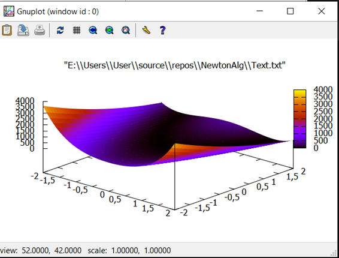
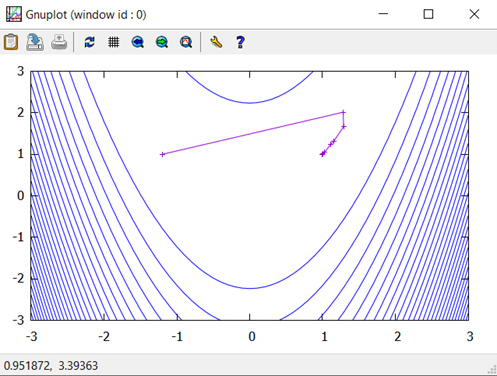

# NewtonAlgorithm


## Spis treści
* [Informacje ogólne](#general-info)
* [Szczegółowe omówienie algorytmu optymalizacji](#features)
* [Technologie](#technology)
* [Instalacja](#setup)
* [Bibliografia](#bibliography)

## Informacje ogólne
Projekt powstał w ramach zajęć "Teoria i Metody Optymalizacji" na studiach magisterskich na kierunku Automatyka i Robotyka.
Współautorem jest Dorian Janiak ([Yep97](https://github.com/Yep97))

Temat projektu to:

**Zastosowanie zmodyfikowanej metody Newtona do znajdowania minimum funkcji nieliniowej.**

## Szczegółowe omówienie algorytmu optymalizacji

Zmodyfikowana metoda Newtona jest iteracyjnym algorytmem służącym do znajdywania minimum zadanej funkcji celu f(x). 
Metodę Newtona z modyfikacją nazywa się metodą Newtona-Raphsona, a sama modyfikacja polega na dodaniu do algorytmu metody znajdującej minimum kierunkowe.

### Typ algorytmu
Iteracyjny algorytm optymalizacji lokalnej.

### Zastosowane kryteria stopu



Zbieżność zastosowanego algorytmu: kwadratowa

### Schemat działania algorytmu



### Ograniczenia algorytmu



## Technologie

Do napisania programu implementującego algorytm Newton’a został wykorzystany język **C#** wraz z zintegrowanym środowiskiem programistycznym **Visual Studio**. Projekt opiera się na platformie **WPF** służącej do tworzenia aplikacji okienkowych. Do implementacji parsera funkcji użyto biblioteki **„Mxparser”**. Wizualizacje wykresów wykonano za pomocą biblioteki **„GnuplotCSharp”**. Jako pomocniczą bibliotekę do zaawansowanych działań matematycznych oraz operacji na zbiorach liczb wykorzystano **„Accord”**. Reszta użytych bibliotek to wbudowane biblioteki systemowe.

## Działanie programu

Program działa w trybie graficznym i wygląda tak jak zdjęciu poniżej. 



Wyniki działania algorytmu są prezentowane na kilka sposobów. Pierwszy z nich to postać wynikowa, w której pokazana jest kolejno: wartość funkcji w punktach optymalnych, wartości punktów optymalnych oraz kryterium stopu, które zatrzymało algorytm. Drugi to postać wpisów kolejnych iteracji działania algorytmu w tabeli w dolej części okna. Wykreślone wyniki posiadają dokładność 10^-3. Dodatkowo użytkownik może zlecić wykreślenie wykresu 3D badanej funkcji oraz wykresu warstwic wraz ze ścieżką z wyszczególnionymi punktami reprezentującymi kolejne iteracje algorytmu. Przykładowe wykresy zostały umieszczone na poniższych zdjęciach.





### Zasady wprowadzania danych początkowych

1. Użytkownik samodzielnie podaje funkcję do zbadania. Dozwolone funkcje w programie to: 
2. wielomianowe,
3. wykładnicze (eksponencjalne),
4. logarytmiczne,
5. potęgowe,
6. trygonometryczne.
 
Maksymalna ilość zmiennych x to 5. Następnie użytkownik może podać maksymalną liczbę iteracji algorytmu (domyślnie 50), a także punkty startowe x0. Do wykreślania wykresów użytkownik podaje zakres przedziałów do wyświetlenia oraz krok wykreślania kolejnych punktów wykresu. 

### Przykład testowy - funkcja rosenbrocka

#### Funkcja Rosenbrocka

Funkcja Rosenbrocka z jednym minimum globalnym. Funkcja tego typu powinna z każdego punktu startowego docierać do minimum globalnego. Algorytm w tym przykładzie nie powinien utknąć w punkcie w pewien sposób dla siebie „osobliwym”. Postać funkcji wyraża wzór:



Wybrany punkt startowy algorytmu to x0=(-1,2;1). Liczbę iteracji ustawiono na domyślną wartość 50. Przedziały wykresów również ustawiono na domyślną wartość to znaczy x,y∈〈-2,2〉 a krok rysowania na 0,1.

Algorytm zakończył działanie po siedmiu iteracjach. Aktywowanym kryterium stopu była wartość bezwzględna z różnicy kolejnych iteracji. Znaleziony punkt optymalny to x7=(0,997;0,994) a wartość funkcji w tym punkcie wyniosła F(x7)=0,000. Porównując z teoretycznymi wartościami tej funkcji wynoszącymi: xop=(1;1) i F(xop)=0 otrzymane wyniki są zadowalająco dobre.








# Instalacja

Do napisania programu implementującego algorytm Newton’a został wykorzystany język **C#** wraz z zintegrowanym środowiskiem programistycznym **Visual Studio**. Projekt opiera się na platformie **WPF** służącej do tworzenia aplikacji okienkowych. Do implementacji parsera funkcji użyto biblioteki **„Mxparser”**. Wizualizacje wykresów wykonano za pomocą biblioteki **„GnuplotCSharp”**. Jako pomocniczą bibliotekę do zaawansowanych działań matematycznych oraz operacji na zbiorach liczb wykorzystano **„Accord”**. Reszta użytych bibliotek to wbudowane biblioteki systemowe.

Aby uruchomić ten projekt trzeba sklonować repozytorium i zaimportować je do Visual Studio
```
$ git clone git@github.com:Turandor/NewtonAlgorithm-1.git
```

Dodatkowo trzeba pobrać biblioteki:
1. [Mxparser](http://mathparser.org/)
2. [Gnuplot](http://www.gnuplot.info/)
3. [Accord](http://accord-framework.net/docs/html/N_Accord_Math.htm)

# Bibliografia
1. http://staff.iiar.pwr.wroc.pl/ewa.szlachcic/materialy%20dydaktyczne/air_studia_2_stopnia/FINDEISEN_Metody_obliczeniowe_optymalizacji.pdf - Metoda Newtona
2. http://www.ing.unitn.it/~bertolaz/2-teaching/2011-2012/AA-2011-2012-OPTIM/lezioni/slides-mND.pdf - Metoda Armijo
3. https://www.uio.no/studier/emner/matnat/math/MAT-INF1100/h07/undervisningsmateriale/kap7.pdf – Wzór hesjan w punkcie
4. https://github.com/AwokeKnowing/GnuplotCSharp - biblioteka gnuplot dla C#
